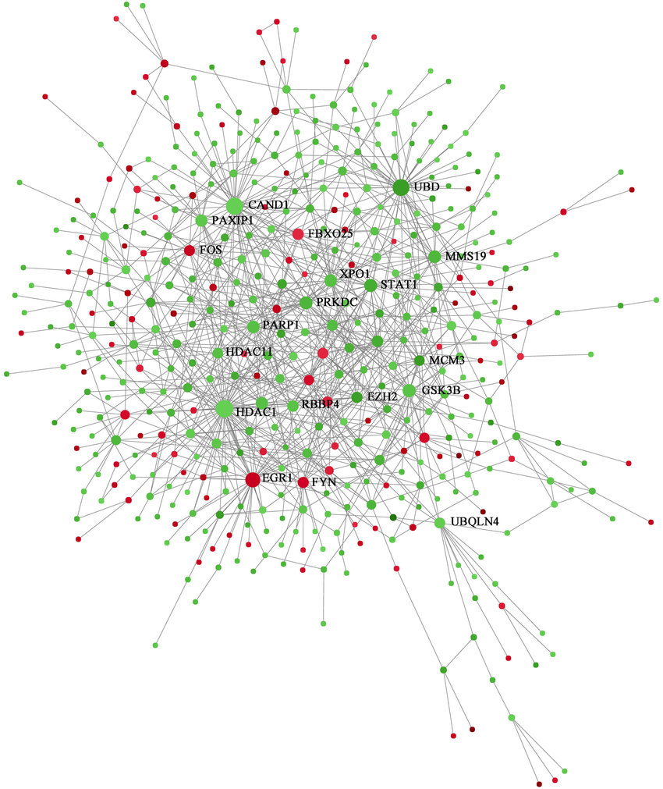

# Linear and Integral Programming 

Class material with examples and exercises about Linear and Integral
Programming, an area from Optimization. An optimization problem is, usually,
written as

```{math}
minimize f(x) subject to  x em D, 
```

where D, the feasible set, is subset of n-dimensional real space and f, objective function from D to the real line.
In this case, we are dealing with linear programming, so the  objective function will be an [affine function](https://en.wikipedia.org/wiki/Affine_transformation) and D will be built from linear constraints, that is, it will be a simplex. 

Here I will put some problem sets written majorly in portuguese from this specific
subject and solve it manually and with Julia Optimization Package
[(JuMP)](https://jump.dev/JuMP.jl/stable/). I will use the GLPK optimizer for
the solvers and the structure will be as a notebook ([Jupyter
Notebook](https://jupyter.org/)) 

## Assignments 

### Assignment 1 

Proteins are macromolecules built in a modular format, composed of *domains*,
which are functional or structural units of the protein independent of the
rest. They interact with other proteins, often through specific domains that
each has. For example, if protein 1 has domain A, and protein 2 has domain B,
and A interacts with B, then 1 interacts with B. We then form a
*Protein-Protein Interaction Network (PPI Network)* generated by domain-domain
interactions. From the information of PPI networks, which are easier to
obtain, we can infer the domains that interact.



[ Developed by Wei Zhong, et al. ](https://www.researchgate.net/figure/An-overview-of-the-PPI-network-The-PPI-network-was-generated-using-NetworkAnalyst-Red_fig5_323136513)

The method we show here, studied by [Guimarães]
(https://doi.org/10.1186/gb-2006-7-11-r104), is based on the concept of
parsimony: we want to find the smallest set of interactions between domains
that explain the interactions we see on the PPI network. In particular, we can
set up this problem in a linear program format. We apply this idea to a
hypothetical example and real data, with almost 200 thousand interactions from
which we can select. We use Cbc and GLPK inside JuMP to solve this problem.

See the notebook [here](https://nbviewer.jupyter.org/github/lucasmoschen/linear-programming/blob/main/assignment1/notebook.ipynb)

## Simplex Method 

The simplex method is a procedure invented in the late 1940s by George Dantzig
to solve linear programs iteratively. Within the viable space, the objective
function is improved at each iteration. At the same time, it solves the dual
problem, which makes it a robust algorithm. From any linear program, the first
step is to convert to canonical form and in this format, the problem is easily
solved.

Based on [AMP, Chapter 2](http://web.mit.edu/15.053/www/AMP-Chapter-02.pdf), I
develop this import algorithm using Python and Numpy. The code is explained in
form of a Jupyter notebook and it can be visualized [here](https://nbviewer.jupyter.org/github/lucasmoschen/linear-programming/blob/main/simplex_method/simplex_code.ipynb).

## Problem Sets

### Pset 1 

This is based on the first chapter of [A Gentle Introduction to
Optimization](https://www.amazon.com.br/Gentle-Introduction-Optimization-B-Guenin/dp/1107053447)
and it's focused on modelling problems. Here we will also have constraints of
the type x is an integer. I could solve problems as sudoku with those
tools. 

See the notebook [here](https://nbviewer.jupyter.org/github/lucasmoschen/linear-programming/blob/main/homeworks/hw1/notebook.ipynb)

### Pset 2 

This problem set is based on the eighth chapter from [Applied Mathematical
Programming](http://web.mit.edu/15.053/www/AMP.htm) and the questions are
related to the general network-flow problem. For instance, the transportation
problem, the assignment problem and the maximum flow problem. 

See the notebook [here](https://nbviewer.jupyter.org/github/lucasmoschen/linear-programming/blob/main/homeworks/hw2/notebook.ipynb)

### Pset 3

This problem set is based on the ninth chapter from [Applied Mathematical
Programming](http://web.mit.edu/15.053/www/AMP.htm) and the questions are
related to the integer linear programming.

See the notebook [here](https://nbviewer.jupyter.org/github/lucasmoschen/linear-programming/blob/main/homeworks/hw3/notebook.ipynb)
